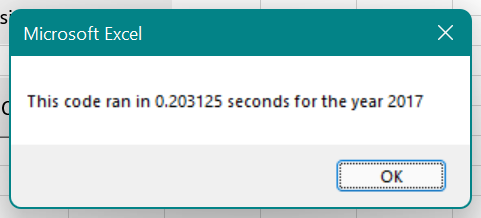
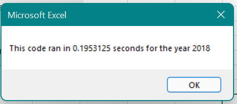

# Stock Analysis

## Purpose
In our analysis, we wish to look at the viability of these dozen stocks for investment so we can help Steve and his parents make good investment decisions. With two years of stock data we are able to determine how these stocks have performed recently and perhaps how they may perform in the future.

## Results
Our [analysis](VBA_Challenge.xlsm) show mixed results across the two years. In 2017 all but one stock had positive returns ranging from 5.5% and 199.4%. 2018, however, was a very different year. In 2018 only 2 stocks experienced positive returns. The rest had losses ranging from -3.5% and -62.6%. Two stocks (ENPH and RUN) stand out as the only to have positive returns both years. ENPH in particular experienced over 80% return for both years. Both operations took approximately .2 seconds as shown below.

## Summary

Refactoring code can be difficult and tedious. Partcicularly if you are not the one that wrote the original code. Reading and interpreting other's code, or you own old code which you have forgotten, can be very time consuming. However, the efficiency gains can be worthwhile if efficiency is important to the final result.

The most obvious advantage of the refactored script is the speed. Before refactoring the process took almost a full second. The new code cut that time by one fifth. The difference from 1 to .2 seconds may seem small, but if you had to run the script multiple times or the script was needed for producing data for important visuals, this time could greatly enhance its usability.
